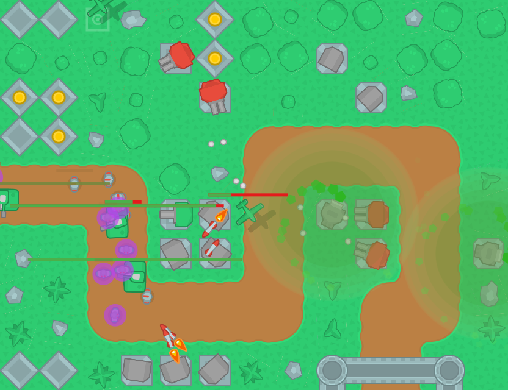
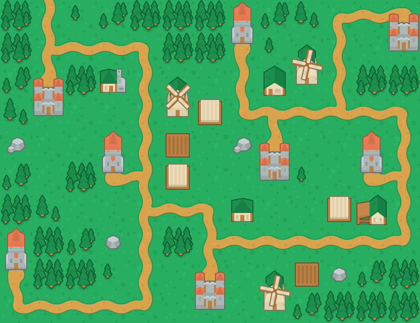

# Tower Defense

A classic tower defense game. The goal is to prevent the enemies from reaching your base. You do this by placing various towers with different features along the road that attack the enemies.

When you start the game, you can see the map. From here you can select one of the eight different levels. To start a level, click on the respective castle.

As soon as you build your first tower, the enemies will start marching on the road (except planes) towards your base.
You can place any of the following towers on an empty gras tile:

- Factory: produces coins
- Poison Field: slows down enemies
- AAC: fires fast bullets with a high fire rate
- Double Rocket: launches slow rockets that deal high damage
- Cannon: always fires in the same direction
- Missile Silo: launches homing missiles
- Tesla Tower: generates electric barriers that deal damage and slow down enemies

Towers normally focus on the closest enemy that reaches their line of sight. This makes it challengin because towers don't always attack the most dangerous enemy!

There are eight different enemies:

- Soldier: simple enemy, weak against everything
- Scout: very fast enemy
- Robot: armoured enemy, slow
- Tank: heavily armoured
- Healer: regenerates hitpoints of nearby enemies
- Plane: flies directly towards the base
- Bomber: like the plane but heavier and not as fast
- Enhanced Tank: enhanced version of the tank: faster, tougher, regenerates hitpoints

In every level you can take a look at some hints on the left side.
